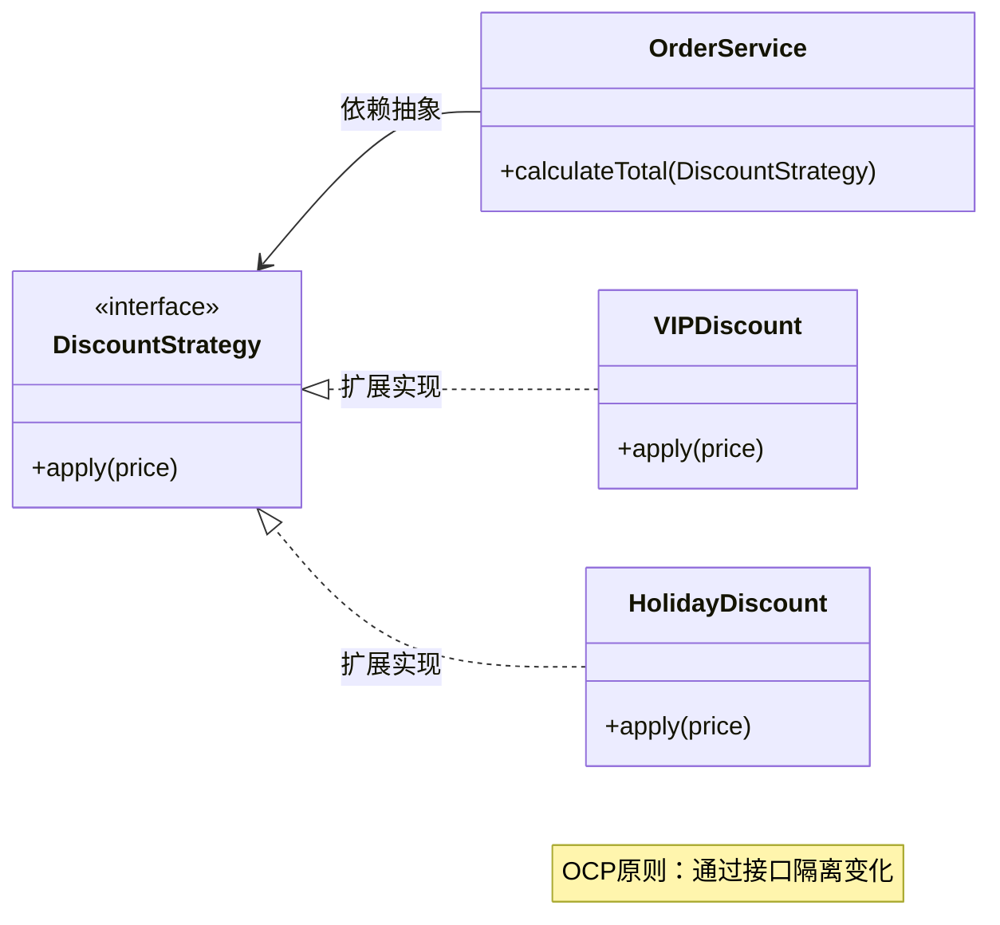

# 杜绝软件退化：从开放-封闭原则到领域驱动设计的演进

软件开发中最大的挑战往往不是构建第一个版本，而是如何随着时间的推移，在不断变化的需求洪流中保持代码的生命力。许多系统在初期设计优雅，但经过几次迭代后，便沦为难以维护的"大泥球"（Big Ball of Mud）。这种现象被称为**软件退化**。

本文将探讨如何利用**开放-封闭原则（OCP）**、**两顶帽子**的开发模式，以及**充血模型**（Rich Domain Model）来对抗软件熵增，特别是如何解决传统贫血模型中"Service 注入地狱"的问题。

<!-- more -->

## 一、软件退化的根源与 OCP 的救赎

软件退化的本质是系统复杂度的失控。当新需求到来时，如果开发者总是选择"阻力最小"的路径——即直接在原有的、已经很复杂的类或方法中通过 `if-else` 堆砌新逻辑，系统就会迅速腐化。

### 开放-封闭原则（OCP）

**开放-封闭原则**（Open-Closed Principle）是面向对象设计（SOLID）的核心之一，它为系统的演化指明了方向：

```infographic
infographic list-grid-badge-card
data
  title OCP 开闭原则核心要义
  items
    - label Open for Extension
      desc 对扩展开放：通过新增模块、类或方法来扩展功能
      icon mdi:puzzle-plus
    - label Closed for Modification
      desc 对修改封闭：不修改已有的、经过测试的稳定代码
      icon mdi:lock-check
```

OCP 的精髓在于**隔离变化**。如果每次增加新功能都需要修改核心业务类，那么每次发布都可能引入回归 Bug。理想的状态是：新功能通过新增代码实现，而老代码对此一无所知，却能与其和谐共存。

### OCP 实现方式对比

```infographic
infographic compare-binary-horizontal-simple-fold
data
  title OCP 正确 vs 错误实现
  items
    - label ❌ 错误方式
      desc 直接修改原有代码，堆砌 if-else 分支，每次需求变更都触碰核心逻辑
    - label ✅ 正确方式
      desc 通过接口/抽象类定义契约，新功能通过实现接口扩展，原有代码无需改动
```


*(图示：通过策略模式扩展功能，符合 OCP 原则)*

## 二、两顶帽子：重构与新功能的节奏

在实际开发中，很难一开始就设计出完全符合 OCP 的系统。需求的变更往往出乎意料。这时，Kent Beck 提出的"**两顶帽子**"隐喻就显得至关重要。

### 开发过程中，我们永远只戴一顶帽子：

```infographic
infographic list-grid-compact-card
data
  title 两顶帽子开发模式
  items
    - label 🎩 重构的帽子
      desc 不改变软件可观察行为，只调整内部结构。提取方法、重命名、抽象接口，为新功能铺路。
      icon mdi:wrench
    - label 🧢 新功能的帽子
      desc 添加新的用户行为。在重构良好的基础上，新功能实现应顺理成章——添加类、实现接口。
      icon mdi:plus-circle
```

**保持软件不退化的关键，在于绝不混戴这两顶帽子。** 许多开发者试图在添加新功能的同时顺手修改原有结构，导致逻辑混乱，Bug 丛生。

```infographic
infographic list-row-simple-horizontal-arrow
data
  title 正确的开发流程
  items
    - label 识别变化点
      desc 分析新需求影响范围
    - label 戴上重构帽
      desc 调整结构以适应变化
    - label 切换功能帽
      desc 扩展实现新功能
    - label 验证与测试
      desc 确保行为正确
```

## 三、贫血模型 vs. 充血模型：对抗复杂度的战场

在 Java 企业级开发（尤其是 Spring 生态）中，我们最熟悉的模式莫过于：`Controller` → `Service` → `DAO` → `Database`。在这种架构下，实体类（Entity）通常只有字段和 Getter/Setter，不包含任何业务逻辑。这就是典型的**贫血模型（Anemic Domain Model）**。

### 1. 贫血模型的困境：Service 层的膨胀

在贫血模型中，所有的业务逻辑都被剥离到了 Service 层。这就导致了一个常见现象：**实体类像是一个无魂的僵尸，只是数据的搬运工；而 Service 层则变成了上帝类（God Class）。**

```mermaid
graph TD
    subgraph Anemic[贫血模型：Service 包含所有逻辑]
        C[Controller] --> S[OrderService<br/>(God Class)]
        S -->|注入| U[UserDAO]
        S -->|注入| P[ProductDAO]
        S -->|注入| I[InventoryDAO]
        S -->|注入| CP[CouponDAO]
        S -.->|直接修改数据| O[Order Entity<br/>(仅 Getter/Setter)]
    end
    style S fill:#ffcccc,stroke:#333,stroke-width:2px
    style O fill:#f9f9f9,stroke:#999,stroke-dasharray: 5 5
```
*(图示：Service 层庞大臃肿，Entity 层贫瘠)*

#### 场景推演：注入多个 DAO 的噩梦

假设我们在做一个电商系统的"下单"功能。在贫血模型下，`OrderService` 的 `createOrder` 方法可能会变成这样：

```java
@Service
public class OrderService {
    @Autowired private UserDAO userDAO;
    @Autowired private ProductDAO productDAO;
    @Autowired private InventoryDAO inventoryDAO;
    @Autowired private CouponDAO couponDAO;
    @Autowired private PaymentDAO paymentDAO;

    @Transactional
    public void createOrder(Long userId, Long productId, int count, Long couponId) {
        // 1. 校验用户状态
        User user = userDAO.findById(userId);
        if (user.getStatus() != ACTIVE) throw new RuntimeException(...);

        // 2. 校验商品并扣减库存
        Product product = productDAO.findById(productId);
        if (inventoryDAO.getCount(productId) < count) throw new RuntimeException(...);
        inventoryDAO.decrease(productId, count);

        // 3. 计算优惠
        Coupon coupon = couponDAO.findById(couponId);
        // ... 一大堆计算逻辑 ...

        // 4. 创建订单对象（只是数据载体）
        Order order = new Order();
        order.setUserId(userId);
        order.setPrice(finalPrice);
        // ... Set 了一堆属性 ...
        
        orderDAO.save(order);
    }
}
```

**这种代码的问题在哪里？**

```infographic
infographic list-grid-badge-card
data
  title 贫血模型的四宗罪
  items
    - label 违背 OCP
      desc 任何逻辑变更都需修改 OrderService，系统极不稳定
      icon mdi:alert-circle
    - label 破坏封装
      desc 数据与行为分离，任何 Service 都可随意修改 Entity
      icon mdi:shield-off
    - label 依赖地狱
      desc Service 注入大量 DAO，处理本不该关心的细节
      icon mdi:spider-web
    - label 面向过程
      desc 本质是披着 OOP 外衣的 Procedural Code
      icon mdi:function
```

### 2. 充血模型：回归真实世界的建模

**充血模型（Rich Domain Model）** 也就是**领域驱动设计（DDD）** 所提倡的模式。其核心理念是：**数据和行为应该在一起**。对象不仅有属性（State），更有行为（Behavior）。

```mermaid
graph TD
    subgraph Rich[充血模型：行为归还给对象]
        App[Application Service<br/>(协调/防腐/事务)] -->|委托业务| O[Order 聚合根<br/>(状态 + 核心行为)]
        O -->|内部维护| I[OrderItem]
        O -.->|调用领域能力| C[Coupon 实体]
        App -->|仅负责持久化| R[OrderRepository]
    end
    style O fill:#ccffcc,stroke:#333,stroke-width:2px
    style App fill:#e6f3ff,stroke:#333
```
*(图示：逻辑分布在各个 Entity 中，Service 层变薄且作为协调者)*

#### 重构后的下单逻辑

```java
// Order 聚合根：包含了订单相关的核心逻辑
public class Order {
    private List<OrderItem> items;
    private Money totalAmount;
    private OrderStatus status;

    // 行为：添加商品
    public void addProduct(Product product, int count) {
        // 订单自己知道如何添加商品，如何计算小计
        this.items.add(new OrderItem(product, count));
        recalculateTotal();
    }

    // 行为：应用优惠券
    public void applyCoupon(Coupon coupon) {
        if (!coupon.isValid()) throw new DomainException("无效优惠券");
        // 订单自己计算折后价格
        this.totalAmount = coupon.calculateDiscount(this.totalAmount);
    }
    
    // 行为：支付
    public void pay() {
        if (this.status != CREATED) throw new StateException("状态不对");
        this.status = PAID;
    }
}
```

此时的 Service 层会变得非常薄：

```java
@Service
public class OrderApplicationService {
    @Autowired private OrderRepository orderRepository;
    @Autowired private ProductRepository productRepository;

    @Transactional
    public void placeOrder(PlaceOrderCommand cmd) {
        // 1. 准备数据
        Product product = productRepository.findById(cmd.getProductId());
        
        // 2. 业务行为委托给领域对象
        Order order = new Order();
        order.addProduct(product, cmd.getCount());
        
        // 3. 持久化
        orderRepository.save(order);
    }
}
```

**充血模型的优势：**

```infographic
infographic list-grid-badge-card
data
  title 充血模型的四大优势
  items
    - label 符合真实世界
      desc 对象即现实，订单包含与之相关的规则约束
      icon mdi:earth
    - label 高内聚
      desc 库存归 Inventory，优惠归 Coupon，职责清晰
      icon mdi:target
    - label 可测试性
      desc 直接对领域对象编写单元测试，无需 Spring 容器
      icon mdi:test-tube
    - label 消除依赖地狱
      desc Service 不再注入大量 DAO，通过聚合根协作
      icon mdi:check-decagram
```

## 四、总结：让代码讲述业务故事

软件退化往往始于对业务逻辑的轻视。当我们习惯于将所有逻辑一股脑塞进 Service 方法，通过注入无数个 DAO 来拼凑功能时，我们实际上是在放弃面向对象的优势，退回到了面向过程的时代。

```infographic
infographic sequence-steps-simple
data
  title 防止软件退化的三板斧
  items
    - label 时刻重构
      desc 戴好重构帽，添加新功能前先清理战场
    - label 拥抱 OCP
      desc 用扩展代替修改，隔离变化点
    - label 回归对象
      desc 采用充血模型，让 Entity 承载业务逻辑
```

当你的代码能够清晰地表达真实世界的业务规则，而不是充满了数据库操作的细节时，软件的生命力自然得以延续。这不仅是技术的选择，更是对业务复杂度的尊重。

---

> **延伸阅读**
> - 《领域驱动设计：软件核心复杂性应对之道》- Eric Evans
> - 《重构：改善既有代码的设计》- Martin Fowler
> - 《整洁架构》- Robert C. Martin
```

---